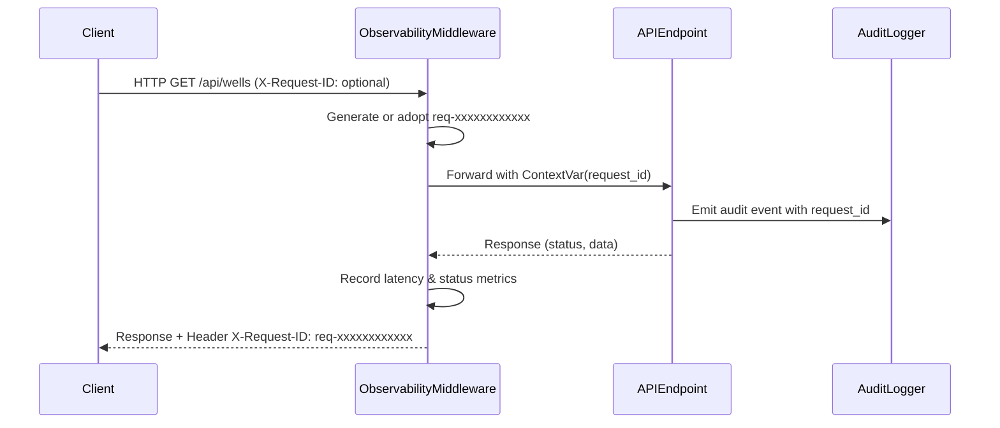

# NWIS Phase 9 — Observability, Structured Logging & Metrics Architecture

## 1. Overview
NWIS implements a lightweight, zero-dependency observability framework designed for enterprise production monitoring, SIEM integration, and incident triage without adding bulky external infrastructure.

Key pillars:
1. **Correlation:** Every inbound request is assigned or preserves a unique `X-Request-ID`.
2. **Structured Logging:** Standard single-line JSON formatted records with automatic credential scrubbing.
3. **Operational Metrics:** Thread-safe in-memory counters, latency gauges, and Prometheus-compatible output via `/api/metrics`.
4. **Health & Readiness:** Dedicated `/health` (liveness) and `/api/ready` (dependency readiness) endpoints.

---

## 2. Request Correlation & Tracing
All HTTP requests pass through `ObservabilityMiddleware` ([`backend/app/core/observability.py`](file:///d:/Internship/sih%20well/backend/app/core/observability.py)):



Response headers always include:
```http
X-Request-ID: req-8f192b4a3c10
```

---

## 3. Structured Logging Specification
When structured logging is active, log records are emitted as valid JSON objects on stdout/stderr:

```json
{
  "timestamp": "2026-09-27T07:15:30.120456+00:00",
  "level": "INFO",
  "service": "nwis-backend",
  "logger": "nwis.access",
  "event": "HTTP_REQUEST",
  "request_id": "req-8f192b4a3c10",
  "method": "GET",
  "path": "/api/wells/map-markers",
  "status_code": 200,
  "duration_ms": 14.25,
  "message": "GET /api/wells/map-markers -> 200 (14.25ms)"
}
```

### Sensitive Field Scrubbing
Loggers scrub any dictionary key or parameter matching:
`password`, `secret`, `token`, `jwt`, `authorization`, `api_key`, `cookie`, `access_token`, `hashed_password`.

---

## 4. Application Metrics API (`/api/metrics`)
The system exposes live telemetry and server health metrics at `GET /api/metrics`.

### Supported Formats:
- **JSON (Default):** Accessible via standard `GET /api/metrics`
- **Prometheus Exposition:** Accessible via `GET /api/metrics?format=prometheus` or `Accept: text/plain`

### Sample JSON Metric Payload:
```json
{
  "uptime_seconds": 1845.2,
  "requests": {
    "total": 420,
    "total_errors": 0,
    "by_status": {
      "200": 412,
      "404": 8
    },
    "avg_duration_ms": 8.42,
    "max_duration_ms": 64.10
  },
  "realtime_telemetry": {
    "points_processed": 1450,
    "rejected_count": 0,
    "stale_count": 0,
    "active_alerts": 0
  },
  "document_intelligence": {
    "uploads_total": 4,
    "approvals_total": 3,
    "rag_queries_total": 12,
    "copilot_queries_total": 8
  },
  "integrations": {
    "ertmac": "DISABLED",
    "witsml": "DISABLED",
    "wits0": "DISABLED",
    "demo_replay": "STANDBY"
  },
  "timestamp": "2026-09-27T07:16:00.000000+00:00"
}
```

### Sample Prometheus Output:
```text
# HELP nwis_uptime_seconds Process uptime in seconds
# TYPE nwis_uptime_seconds gauge
nwis_uptime_seconds 1845.2

# HELP nwis_http_requests_total Total HTTP requests handled
# TYPE nwis_http_requests_total counter
nwis_http_requests_total 420

# HELP nwis_http_errors_total Total 4xx and 5xx responses
# TYPE nwis_http_errors_total counter
nwis_http_errors_total 0

# HELP nwis_http_latency_avg_ms Average request latency in milliseconds
# TYPE nwis_http_latency_avg_ms gauge
nwis_http_latency_avg_ms 8.42

# HELP nwis_active_alerts Active unacknowledged drilling alerts
# TYPE nwis_active_alerts gauge
nwis_active_alerts 0

# HELP nwis_telemetry_points_total Total rig telemetry points processed
# TYPE nwis_telemetry_points_total counter
nwis_telemetry_points_total 1450
```

---

## 5. Health vs. Readiness Specification

| Endpoint | Type | Purpose | Success Condition |
|---|---|---|---|
| `GET /health` | **Liveness Probe** | Verifies process is alive and accepting connections. | Returns HTTP 200 `{"status": "ok"}`. |
| `GET /api/ready` | **Readiness Probe** | Evaluates dependency health (PostgreSQL, PostGIS, CSV fallback, upstream adapters). | Returns HTTP 200 with dependency inventory. Does NOT report failure if CSV fallback is active. |
